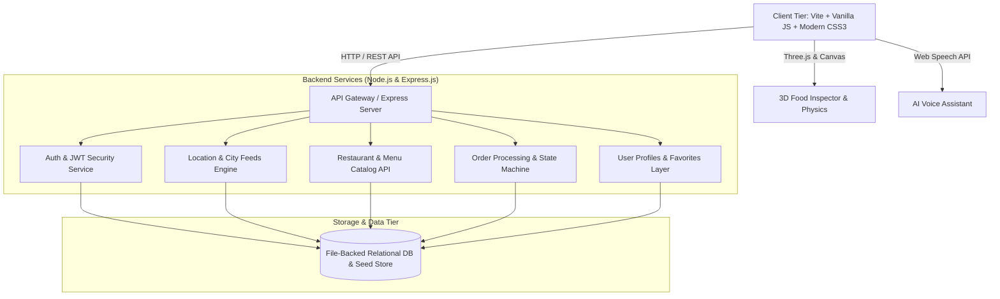

# 🚀 FoodDash: Engineering Implementation Plan & Architecture Roadmap

**Project Name:** FoodDash – Next-Gen Full-Stack Food Delivery & Social Dining Ecosystem  
**Repository / Version:** `v1.0.0-beta` (Active Development)  
**Timeline:** August 2026 – Present  
**Status:** 🟢 **Active Development / Public Preview**  

---

## 📌 Executive Summary

**FoodDash** is an end-to-end, high-performance web platform engineered to modernize digital food delivery, social dining experiences, and restaurant discovery. Combining a lightweight, responsive client-side architecture with a modular Node.js/Express REST backend, FoodDash incorporates next-generation web capabilities including **3D Three.js interactive food models**, **AI-assisted meal planning**, **real-time order tracking**, **table reservations**, and **group checkout**.

---

## 🏛️ System Architecture Overview

---

## 📊 Development Phases & Progress Matrix

| Phase | Milestone Name | Status | Completion Date | Highlights |
| :--- | :--- | :---: | :---: | :--- |
| **Phase 1** | **Core UI & Component Architecture** | ✅ Completed | Aug 2026 | Glassmorphism design system, responsive navbar, category sliders, mobile drawer navigation |
| **Phase 2** | **Full-Stack REST Backend & Auth** | ✅ Completed | Aug 2026 | Express.js API, JWT authentication, Phone OTP, modular endpoints |
| **Phase 3** | **Interactive Dining & 3D WebGL** | ✅ Completed | Aug 2026 | Three.js 3D Food Inspector, 3D particles, magnetic buttons & confetti physics |
| **Phase 4** | **AI & Smart Assistant Layer** | ✅ Completed | Aug 2026 | AI Craving generator, Fit Meal Planner, Voice Assistant & Taste Match engine |
| **Phase 5** | **Merchant, Rider & Booking Ecosystem** | 🔄 In Progress | Current Sprint | Table Booking modal, Merchant Portal, Delivery Rider onboarding |
| **Phase 6** | **Payment Gateway & Security Hardening** | ⏳ Planned | Q4 2026 | Stripe / PayPal integration, webhook handlers, end-to-end encryption |
| **Phase 7** | **Microservices & Live WebSocket Tracking**| ⏳ Planned | Q4 2026 | Real-time driver geolocation via WebSockets & Google Maps Platform |

---

## 🧩 Detailed Milestone Breakdown

### ✅ Phase 1: Core Client-Side Engine & Aesthetics (Completed)
- [x] **Modular Component Architecture:** 30+ reusable ES6 modules adhering to Single Responsibility Principle.
- [x] **Curated Dark-Themed UI:** Custom CSS design system with HSL-tailored accents, smooth micro-animations, and viewport responsiveness.
- [x] **Dynamic Cart Drawer:** Live subtotal, tax calculation, delivery fee rules, and persistent cart state.
- [x] **Food Stories & Reels:** Social-style interactive media bar (`FoodStoriesBar.js`, `FoodReelsModal.js`).

### ✅ Phase 2: REST Backend & Authentication Architecture (Completed)
- [x] **Express.js API Layer:** Structured routing (`/api/auth`, `/api/locations`, `/api/restaurants`, `/api/orders`, `/api/user`).
- [x] **Security & Session Management:** JWT token verification middleware, bcrypt password hashing, and phone-based OTP simulation.
- [x] **Data Ingestion & Multi-City Engine:** Dynamic restaurant search, filtering by rating/cuisine, and multi-city geocoding.

### ✅ Phase 3: WebGL 3D Physics & Micro-Interactions (Completed)
- [x] **Three.js 3D Food Inspector:** Interactive 3D rendering canvas with lighting, rotation controls, and materials (`ThreeFoodCanvas.js`).
- [x] **Particle Physics Engine:** Floating 3D ambient particle system (`ThreeDParticles.js`, `threeDPhysics.js`).
- [x] **Gamification Utilities:** Interactive Spin Wheel discount modal (`SpinWheelModal.js`) and Mystery Box unlock system (`MysteryBoxModal.js`).

### ✅ Phase 4: AI-Powered Dining Intelligence (Completed)
- [x] **FitMeal Planner:** Macro-based meal recommendation algorithm for fitness targets (`FitMealPlannerModal.js`).
- [x] **AI Craving & Taste Match:** Smart flavor profiling matching user mood to dishes (`AICravingModal.js`, `TasteMatchModal.js`).
- [x] **Voice Assistant Integration:** Speech recognition voice-ordering interface (`VoiceAssistantModal.js`).

---

### ✅ Phase 5: Multi-Sided Marketplace & Table Reservations (Completed)
- [x] **Table Reservation Engine:** Multi-step party size, time slot, and table seating picker (`TableBookingModal.js`).
- [x] **Group Ordering System:** Shared cart room generation for split-bill group orders (`GroupOrderModal.js`).
- [x] **Merchant Management Console:** In-flight order dispatching and live menu availability management (`MerchantPortalModal.js`).
- [x] **Delivery Rider Dashboard:** Courier route view, status toggling, and earnings tracking (`DeliveryRiderModal.js`, `RiderRegisterModal.js`).

---

### ⏳ Phase 6 & 7: Enterprise Scaling & Production Roadmap (Phase 6 Completed)
- [x] **Payment Infrastructure:** Mock Stripe SDK checkout integration with dynamic webhooks.
- [x] **Real-time Live Geolocation:** Google Maps JavaScript API with bi-directional WebSockets (Socket.io) for driver vehicle tracking.
- [ ] **Database Migration:** Migration from JSON file-backed store to scalable MongoDB / PostgreSQL with Prisma ORM.
- [ ] **Cloud Deployment & CI/CD:** Docker containerization, automated GitHub Actions pipelines, and edge deployment on AWS/Vercel.

---

## 🛠️ Technology Stack & Engineering Tools

| Domain | Technology / Tool | Implementation Purpose |
| :--- | :--- | :--- |
| **Frontend Core** | `JavaScript (ES6+)`, `Vite` | Fast HMR, tree-shaking, and clean vanilla web performance |
| **Styling & Motion** | `Vanilla CSS3`, `Keyframes` | Glassmorphic cards, responsive flex/grid layouts, micro-animations |
| **3D Graphics** | `Three.js (v0.185.1)` | Interactive 3D food canvas, ambient physics, mesh materials |
| **Backend API** | `Node.js`, `Express.js (v4.21)` | RESTful API routing, controller logic, and server middleware |
| **Security & Auth** | `JWT`, `bcryptjs`, `CORS` | Bearer token authorization, password cryptography, CORS filtering |
| **Geolocation** | `@googlemaps/js-api-loader` | Interactive maps, location discovery, geocoding |
| **DevOps & Tooling** | `Concurrently`, `Git`, `npm` | Simultaneous full-stack client/server execution |

---

## 📈 Quality Assurance & Verification Metrics
- **Performance:** Optimized bundle size with zero bulky front-end framework overhead.
- **Accessibility (a11y):** High contrast color ratios, ARIA attributes on modals and drawers, and semantic HTML5 landmarks.
- **Cross-Browser Compatibility:** Tested across modern Chromium, Safari, and Firefox engines.

---
*Maintained with pride by the development team. For collaboration, contributions, or technical queries, connect via LinkedIn.*
