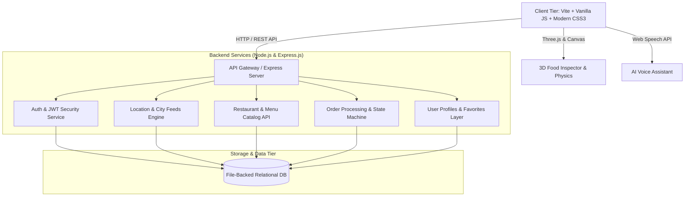

<div align="center">
  
  
  <h1 style="margin: 0;">🚀 FoodDash</h1>
  
  <p><strong>The Next-Generation Full-Stack Food Delivery & Social Dining Ecosystem</strong></p>

  <p>
    <a href="https://github.com/zeeshansaeed6/FoodDash"></a>
    <a href="https://opensource.org/licenses/MIT"></a>
    <a href="https://nodejs.org/"></a>
    <a href="https://vitejs.dev/"></a>
    <a href="https://threejs.org/"></a>
  </p>
  
  <p><i>A high-performance web platform engineered to modernize digital food delivery, incorporating 3D rendering, AI dining intelligence, and real-time social experiences.</i></p>
</div>

<br />

---

## 📖 Table of Contents
- [✨ Key Features](#-key-features)
- [🏛️ System Architecture](#️-system-architecture)
- [🛠️ Technology Stack](#️-technology-stack)
- [📂 Project Structure](#-project-structure)
- [🚀 Quick Start Guide](#-quick-start-guide)
- [📈 Roadmap](#-roadmap)
- [🤝 Contributing](#-contributing)
- [📄 License](#-license)

---

## ✨ Key Features

### 🎨 Modern UI & Glassmorphism Aesthetics
> **Experience a sleek, responsive, and visually stunning interface.**
- **Curated Dark-Themed UI:** Custom CSS design system with HSL-tailored accents, smooth micro-animations, and viewport responsiveness.
- **Dynamic Cart Drawer:** Live subtotal, tax calculation, delivery fee rules, and persistent cart state.
- **Food Stories & Reels:** Social-style interactive media bar (`FoodStoriesBar`, `FoodReelsModal`), bringing Instagram-style engagement to food ordering.

### 🧠 AI-Powered Dining Intelligence
> **Smart algorithms that understand your cravings.**
- **FitMeal Planner:** Macro-based meal recommendation algorithm for specific fitness targets.
- **AI Craving & Taste Match:** Smart flavor profiling matching user mood to specific dishes.
- **Voice Assistant Integration:** Speech recognition voice-ordering interface for hands-free navigation.

### 🎮 WebGL 3D Physics & Micro-Interactions
> **Pushing the boundaries of web interactions with WebGL.**
- **Three.js 3D Food Inspector:** Interactive 3D rendering canvas with dynamic lighting, rotation controls, and realistic materials.
- **Particle Physics Engine:** Floating 3D ambient particle system creating a truly immersive atmosphere.
- **Gamification Utilities:** Interactive Spin Wheel discount modal and Mystery Box unlock system to boost engagement.

### 🌐 Full-Stack REST Backend & Security
> **Robust, scalable, and secure API infrastructure.**
- **Express.js API Layer:** Structured routing with dynamic restaurant search, filtering, and multi-city geocoding.
- **Security & Session Management:** JWT token verification middleware, bcrypt password hashing, and phone-based OTP simulation.
- **Location Engine:** Multi-city geocoding using Google Maps APIs.

### 🍽️ Multi-Sided Marketplace & Merchant Tools
> **Connecting diners, restaurants, and riders seamlessly.**
- **Table Reservation Engine:** Multi-step party size, time slot, and table seating picker.
- **Group Ordering System:** Shared cart room generation for split-bill group orders.
- **Merchant Management Console:** In-flight order dispatching and live menu availability management.
- **Delivery Rider Dashboard:** Courier route view, status toggling, and earnings tracking.

---

## 🏛️ System Architecture

Our platform leverages a clean separation of concerns, utilizing a lightweight client communicating with a modular RESTful Node.js backend.



---

## 🛠️ Technology Stack

| Domain | Technology / Tool | Implementation Purpose |
| :--- | :--- | :--- |
| **Frontend Core** |  `Vite` | Fast HMR, tree-shaking, and clean vanilla web performance |
| **Styling & Motion** |  `Keyframes` | Glassmorphic cards, responsive flex/grid layouts, micro-animations |
| **3D Graphics** |  | Interactive 3D food canvas, ambient physics, mesh materials |
| **Backend API** |  `Express.js` | RESTful API routing, controller logic, and server middleware |
| **Security & Auth** | `JWT`, `bcryptjs`, `CORS` | Bearer token authorization, password cryptography, CORS filtering |
| **Geolocation** | `@googlemaps/js-api-loader` | Interactive maps, location discovery, geocoding |
| **DevOps & Tooling**| `Concurrently`, `Git`, `npm` | Simultaneous full-stack client/server execution |

---

## 📂 Project Structure

```text
FOOD_DELIVERY/
├── public/                 # Static assets (images, icons, manifest.json)
├── server/                 # Express backend source code
│   ├── routes/             # API Endpoint definitions (auth, orders, etc.)
│   ├── db_data.json        # File-backed database simulator
│   └── index.js            # Node.js server entry point
├── src/                    # Frontend source code
│   ├── api/                # Client-side API request wrappers
│   ├── components/         # Reusable UI components (Modals, Navbars, Cards)
│   ├── pages/              # Main view containers (DriverPage, etc.)
│   ├── styles/             # Modular CSS stylesheets
│   ├── utils/              # Utilities (Three.js logic, Google Maps, animations)
│   └── main.js             # Vite application entry point
├── test/                   # Unit and integration test suites
├── index.html              # Main HTML document template
├── package.json            # Node.js dependencies and scripts
└── vite.config.js          # Vite bundler configuration
```

---

## 🚀 Quick Start Guide

### Prerequisites
- Node.js (v18 or higher)
- npm or yarn
- Google Maps API Key (for location tracking features)

### Installation Steps

1. **Clone the repository:**
   ```bash
   git clone https://github.com/zeeshansaeed6/FoodDash.git
   cd FoodDash
   ```

2. **Install dependencies:**
   ```bash
   npm install
   ```

3. **Configure Environment Variables:**
   Create a `.env` file in the project root directory and add the following keys:
   ```env
   PORT=5000
   JWT_SECRET=your_secure_jwt_secret_key_here
   VITE_GOOGLE_MAPS_API_KEY=your_google_maps_api_key_here
   ```

4. **Launch the Platform:**
   Start both the frontend Vite development server and the Node.js backend simultaneously:
   ```bash
   npm run dev
   ```

5. **Access the App:**
   Open your browser and navigate to [http://localhost:5173](http://localhost:5173). The API server will run concurrently on port 5000.

---

## 📈 Roadmap

We are constantly pushing the boundaries of what a web application can do. Here is what is coming next:

- [x] Phase 1: Core UI & Component Architecture
- [x] Phase 2: Full-Stack REST Backend & Authentication
- [x] Phase 3: Interactive Dining & 3D WebGL Physics
- [x] Phase 4: AI & Smart Assistant Layer
- [x] Phase 5: Multi-Sided Marketplace & Table Reservations
- [ ] **Phase 6:** Complete Payment Gateway & Security Hardening (Stripe / PayPal)
- [ ] **Phase 7:** Microservices & Live WebSocket Tracking Refinements
- [ ] **Phase 8:** Database Migration to MongoDB / PostgreSQL via Prisma

*(Check the `PROJECT_ROADMAP.md` file for an exhaustive breakdown.)*

---

## 🤝 Contributing

Contributions are what make the open source community such an amazing place to learn, inspire, and create. Any contributions you make are **greatly appreciated**.

1. Fork the Project
2. Create your Feature Branch (`git checkout -b feature/AmazingFeature`)
3. Commit your Changes (`git commit -m 'Add some AmazingFeature'`)
4. Push to the Branch (`git push origin feature/AmazingFeature`)
5. Open a Pull Request

---

## 📄 License

Distributed under the MIT License. See `LICENSE` for more information.

---

<div align="center">
  <b>Developed with ❤️ for the next generation of food delivery.</b><br>
  <i>For collaboration, contributions, or technical queries, please reach out via GitHub issues or connect with the author.</i>
</div>
