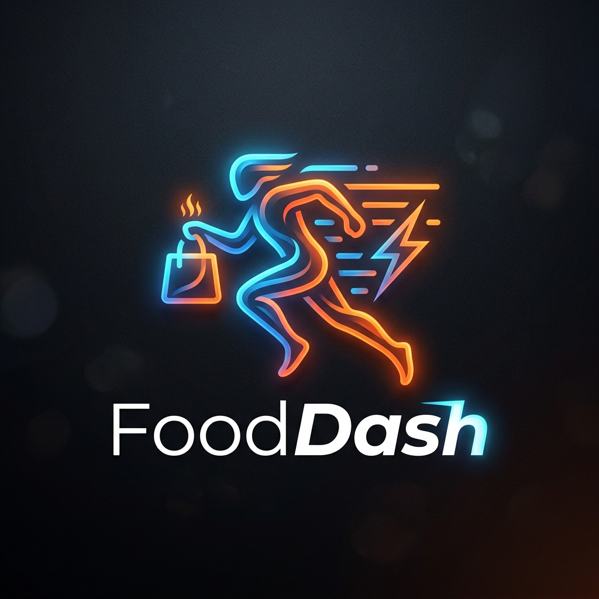
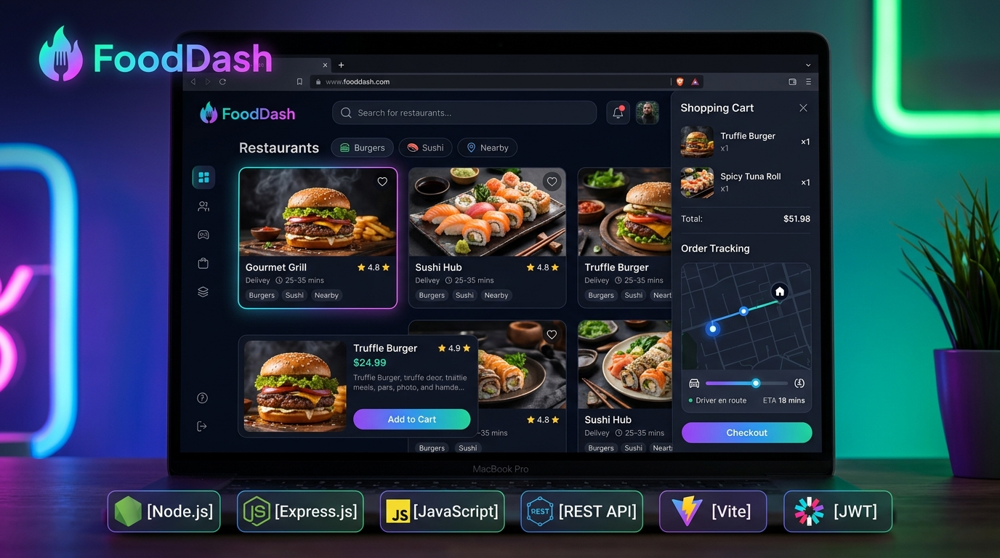
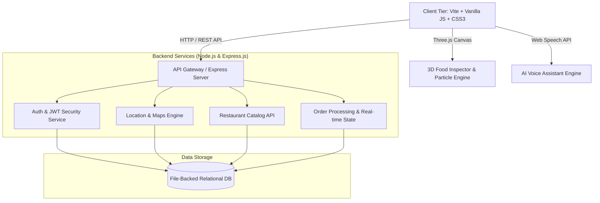

<div align="center">
  
  
  <h1 style="font-size: 3em; font-weight: bold; margin: 0; color: #ff4b2b;">🚀 FoodDash</h1>
  
  <p style="font-size: 1.2em; color: #555;"><strong>The Next-Generation Full-Stack Food Delivery & Social Dining Ecosystem</strong></p>

  <p>
    <a href="https://github.com/zeeshansaeed6/FoodDash"></a>
    <a href="https://opensource.org/licenses/MIT"></a>
    <a href="https://nodejs.org/"></a>
    <a href="https://vitejs.dev/"></a>
    <a href="https://threejs.org/"></a>
  </p>
  
  <p><i>Redefining digital food delivery with immersive 3D rendering, AI dining intelligence, and real-time social experiences.</i></p>
</div>

<br />

<div align="center">
  
</div>

<br />

---

## 📖 Table of Contents
- [🎯 Why FoodDash?](#-why-fooddash)
- [✨ Core Features](#-core-features)
- [🏛️ System Architecture](#️-system-architecture)
- [🛠️ Tech Stack & Tools](#️-tech-stack--tools)
- [📂 Codebase Structure](#-codebase-structure)
- [🚀 Getting Started](#-getting-started)
- [📈 Roadmap & Vision](#-roadmap--vision)
- [🤝 Contribute to FoodDash](#-contribute-to-fooddash)
- [📄 License](#-license)

---

## 🎯 Why FoodDash?

Traditional food delivery apps are flat, transactional, and lack engagement. **FoodDash** brings excitement back to ordering food by blending **e-commerce with social media features, gamification, and WebGL 3D graphics**. 

Whether you're exploring the menu in fully interactive 3D, rolling the mystery discount wheel, or splitting a bill dynamically with friends, FoodDash turns a simple order into an experience.

---

## ✨ Core Features

<details open>
<summary><b>🎨 Glassmorphism UI & Aesthetic Excellence</b></summary>
<br>

- **Curated Dark Theme:** Deep, immersive UI with tailored HSL accents and sleek typography.
- **Micro-Animations:** Fluid transitions, hover states, and dynamic elements powered by vanilla CSS.
- **Dynamic Cart Drawer:** Fully persistent sliding cart with live subtotal, tax calculation, and delivery fee adjustments.
- **Social Food Reels:** Instagram-style stories component (`FoodStoriesBar`, `FoodReelsModal`) for discovering trending dishes.

</details>

<details>
<summary><b>🧠 AI-Powered Dining Intelligence</b></summary>
<br>

- **FitMeal Planner:** Inputs your macro/calorie goals and automatically recommends meals that fit your diet.
- **AI Craving Engine:** Select your mood (e.g., "Cozy", "Spicy", "Comfort"), and our smart flavor profiler finds your perfect match.
- **Voice Assistant:** Hands-free voice ordering using native Web Speech APIs.

</details>

<details>
<summary><b>🎮 Immersive 3D & WebGL Gamification</b></summary>
<br>

- **Three.js Food Inspector:** Rotate, zoom, and inspect your food in real-time 3D before ordering.
- **Ambient Particle Physics:** Floating 3D particle system giving the app an alive, dynamic feel.
- **Gamified Discounts:** Spin-the-wheel and Mystery Box systems to unlock exclusive promo codes.

</details>

<details>
<summary><b>🌐 Full-Stack Node.js Architecture</b></summary>
<br>

- **Express.js API Layer:** Secure, robust REST endpoints for handling everything from auth to geocoding.
- **JWT Security:** Bearer token authorization, bcrypt hashing, and simulated OTP verification.
- **Location Engine:** Integrated with Google Maps for multi-city search and live restaurant distances.

</details>

<details>
<summary><b>🍽️ Multi-Sided Marketplace Tools</b></summary>
<br>

- **Table Reservations:** Multi-step party size and seating time picker.
- **Group Checkout:** Shared cart room generation for seamless split-bill group orders.
- **Merchant & Rider Dashboards:** Dedicated portals for restaurant owners and delivery drivers to manage live orders and availability.

</details>

---

## 🏛️ System Architecture

FoodDash uses a decoupled Client-Server architecture designed for scale and high performance.



---

## 🛠️ Tech Stack & Tools

### Frontend
- **Framework:** `Vite` with Vanilla `ES6+ JavaScript`
- **Styling:** Custom `Vanilla CSS3` (Glassmorphism & Keyframes)
- **3D Engine:** `Three.js (v0.185.1)`
- **Maps:** `@googlemaps/js-api-loader`

### Backend
- **Runtime:** `Node.js`
- **Framework:** `Express.js (v4.21)`
- **Security:** `jsonwebtoken`, `bcryptjs`, `cors`
- **Database:** JSON File-Backed Store (Ready for MongoDB/Prisma Migration)

### DevOps
- **Local Dev:** `concurrently` (runs Vite & Express simultaneously)
- **Testing:** `vitest`, `supertest`, `jsdom`

---

## 📂 Codebase Structure

```text
FOOD_DELIVERY/
├── public/                 # Static assets (images, icons, manifest.json)
├── server/                 # Express backend source code
│   ├── routes/             # Modular API endpoints
│   ├── db_data.json        # Database simulator
│   └── index.js            # Main Node.js server
├── src/                    # Frontend source code
│   ├── api/                # Axios/Fetch API wrappers
│   ├── components/         # 30+ Reusable UI components
│   ├── pages/              # Main application views
│   ├── styles/             # Modular CSS stylesheets
│   ├── utils/              # Three.js logic & utility scripts
│   └── main.js             # Vite application entry point
├── test/                   # Unit & API testing suite
└── index.html              # Main HTML document template
```

---

## 🚀 Getting Started

### 1️⃣ Prerequisites
- **Node.js** (v18 or higher)
- **npm** or **yarn**
- **Google Maps API Key** (Required for location features)

### 2️⃣ Installation & Setup

```bash
# Clone the repository
git clone https://github.com/zeeshansaeed6/FoodDash.git

# Navigate to directory
cd FoodDash

# Install all dependencies
npm install
```

### 3️⃣ Environment Variables
Create a `.env` file in the root directory:
```env
PORT=5000
JWT_SECRET=your_super_secret_jwt_key_here
VITE_GOOGLE_MAPS_API_KEY=your_google_maps_api_key_here
```

### 4️⃣ Boot Up the Platform
Start the frontend dev server and the backend API concurrently:
```bash
npm run dev
```

> **🎉 Success!** The frontend will be live at `http://localhost:5173` and the API at `http://localhost:5000`.

---

## 📈 Roadmap & Vision

We are continually expanding the platform. Here's a glimpse of the future:

- [x] Phase 1: Core UI & Glassmorphism Design System
- [x] Phase 2: Express REST API & Authentication Architecture
- [x] Phase 3: Interactive 3D WebGL Physics & Gamification
- [x] Phase 4: AI Voice Assistant & Smart Meal Planning
- [x] Phase 5: Group Ordering & Table Reservations
- [ ] **Phase 6:** Stripe / PayPal Payment Gateway Integration
- [ ] **Phase 7:** Live WebSockets Delivery Tracking 
- [ ] **Phase 8:** PostgreSQL / Prisma ORM Database Migration
- [ ] **Phase 9:** iOS / Android Mobile Wrapper deployment

---

## 🤝 Contribute to FoodDash

We welcome all contributions! Whether it's reporting a bug, suggesting a new feature, or submitting a pull request.

1. **Fork** the Project
2. Create your Feature Branch: `git checkout -b feature/AmazingFeature`
3. Commit your Changes: `git commit -m 'Add some AmazingFeature'`
4. Push to the Branch: `git push origin feature/AmazingFeature`
5. Open a **Pull Request**!

---

## 📄 License

Distributed under the **MIT License**. See `LICENSE` for more information.

---

<div align="center">
  <b>Developed with ❤️ to push the limits of modern web development.</b><br>
  <i>For collaboration, contributions, or technical queries, please reach out via GitHub issues.</i>
</div>
