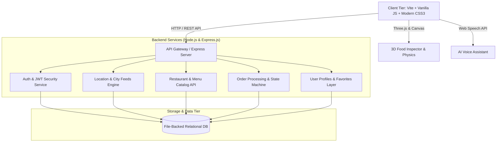

<div align="center">
  
  # 🚀 FoodDash 
  
  **Next-Gen Full-Stack Food Delivery & Social Dining Ecosystem**
  
  [](https://github.com/zeeshansaeed6/FoodDash)
  [](https://opensource.org/licenses/MIT)
  [](https://nodejs.org/)
  [](https://vitejs.dev/)
  [](https://threejs.org/)
</div>

---

## 📌 Executive Summary

**FoodDash** is an end-to-end, high-performance web platform engineered to modernize digital food delivery, social dining experiences, and restaurant discovery. Combining a lightweight, responsive client-side architecture with a modular Node.js/Express REST backend, FoodDash incorporates next-generation web capabilities including **3D Three.js interactive food models**, **AI-assisted meal planning**, **real-time order tracking**, **table reservations**, and **group checkout**.

---

## ✨ Key Features

### 🎨 Modern UI & Glassmorphism Aesthetics
- **Curated Dark-Themed UI:** Custom CSS design system with smooth micro-animations.
- **Dynamic Cart Drawer:** Live subtotal, tax calculation, and persistent cart state.
- **Food Stories & Reels:** Social-style interactive media bar.

### 🧠 AI-Powered Dining Intelligence
- **FitMeal Planner:** Macro-based meal recommendation algorithm for fitness targets.
- **AI Craving & Taste Match:** Smart flavor profiling matching user mood to dishes.
- **Voice Assistant Integration:** Speech recognition voice-ordering interface.

### 🎮 WebGL 3D Physics & Micro-Interactions
- **Three.js 3D Food Inspector:** Interactive 3D rendering canvas with lighting and controls.
- **Particle Physics Engine:** Floating 3D ambient particle system.
- **Gamification Utilities:** Interactive Spin Wheel and Mystery Box unlock system.

### 🌐 Full-Stack REST Backend & Auth
- **Express.js API Layer:** Structured routing with a file-backed JSON data store.
- **Security & Session Management:** JWT authentication and bcrypt password hashing.
- **Location Engine:** Multi-city geocoding using Google Maps APIs.

### 🍽️ Multi-Sided Marketplace
- **Table Reservation Engine:** Multi-step party size and time slot picker.
- **Group Ordering System:** Shared cart room generation for split-bill group orders.
- **Merchant Management Console:** Live menu availability management.
- **Delivery Rider Dashboard:** Courier route view, status toggling, and earnings tracking.

---

## 🏛️ System Architecture



---

## 🛠️ Technology Stack

| Domain | Technology / Tool | Implementation Purpose |
| :--- | :--- | :--- |
| **Frontend Core** | `JavaScript (ES6+)`, `Vite` | Fast HMR, tree-shaking, and clean vanilla web performance |
| **Styling & Motion** | `Vanilla CSS3`, `Keyframes` | Glassmorphic cards, responsive layouts, micro-animations |
| **3D Graphics** | `Three.js (v0.185.1)` | Interactive 3D food canvas, ambient physics |
| **Backend API** | `Node.js`, `Express.js (v4.21)` | RESTful API routing, controller logic |
| **Security & Auth** | `JWT`, `bcryptjs`, `CORS` | Bearer token authorization, password cryptography |
| **Geolocation** | `@googlemaps/js-api-loader` | Interactive maps, location discovery, geocoding |
| **DevOps** | `Concurrently`, `Vite` | Simultaneous full-stack client/server execution |

---

## 🚀 Quick Start Guide

### Prerequisites
- Node.js (v18 or higher)
- npm or yarn
- Google Maps API Key (for location features)

### Installation

1. **Clone the repository:**
   ```bash
   git clone https://github.com/zeeshansaeed6/FoodDash.git
   cd FoodDash
   ```

2. **Install dependencies:**
   ```bash
   npm install
   ```

3. **Set up Environment Variables:**
   Create a `.env` file in the root directory:
   ```env
   PORT=5000
   JWT_SECRET=your_jwt_secret_here
   VITE_GOOGLE_MAPS_API_KEY=your_google_maps_api_key_here
   ```

4. **Run the Application:**
   Starts both the frontend Vite server and the Node.js Express backend simultaneously.
   ```bash
   npm run dev
   ```

5. **Open in Browser:**
   Navigate to `http://localhost:5173`

---

## 📈 Quality Assurance
- **Performance:** Optimized bundle size with zero bulky front-end framework overhead.
- **Accessibility (a11y):** High contrast color ratios, ARIA attributes, and semantic HTML5.
- **Cross-Browser Compatibility:** Tested across modern Chromium, Safari, and Firefox engines.

---

<div align="center">
  <i>Developed with ❤️ for the next generation of food delivery.</i>
</div>
